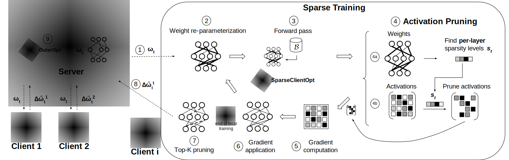

# SparsyFed: Sparse Adaptive Federated Training

[](LICENSE)

This repository contains the official implementation of **"SparsyFed: Sparse Adaptive Federated Training"** ([arXiv:2504.05153](https://arxiv.org/abs/2504.05153)).

## Abstract
Sparse training is often adopted in cross-device federated learning (FL) environments where constrained devices collaboratively train a machine learning model on private data by exchanging pseudo-gradients across heterogeneous networks. Although sparse training methods can reduce communication overhead and computational burden in FL, they are often not used in practice for the following key reasons: (1) data heterogeneity makes it harder for clients to reach consensus on sparse models compared to dense ones, requiring longer training; (2) methods for obtaining sparse masks lack adaptivity to accommodate very heterogeneous data distributions, crucial in cross-device FL; and (3) additional hyperparameters are required, which are notably challenging to tune in FL. This paper presents SparsyFed, a practical federated sparse training method that critically addresses the problems above. Previous works have only solved one or two of these challenges at the expense of introducing new trade-offs, such as clients' consensus on masks versus sparsity pattern adaptivity. We show that SparsyFed simultaneously (1) can produce 95% sparse models, with negligible degradation in accuracy, while only needing a single hyperparameter, (2) achieves a per-round weight regrowth 200 times smaller than previous methods, and (3) allows the sparse masks to adapt to highly heterogeneous data distributions and outperform all baselines under such conditions.

## Pipeline Overview



*SparsyFed pipeline: (1) Server broadcasts the global model $\omega_t$. (2) Client $i$ re-parameterizes local weights. (3) Executes a forward pass on batch $\mathcal{B}$. (4a) Computes layer-wise sparsity $s_t$. (4b) Prunes activations using $s_t$ and stores them. (5) Computes gradients. (6) Applies gradients. (7) Computes model updates and applies `Top-K` pruning. (8) Sends sparse updates $\Delta \tilde{\omega}_{i}^{t}$ back to the server. (9) Applies server optimizer to obtain the global model. Steps (2-6) repeat until convergence.*


## Table of Contents
- [SparsyFed: Sparse Adaptive Federated Training](#sparsyfed-sparse-adaptive-federated-training)
  - [Abstract](#abstract)
  - [Pipeline Overview](#pipeline-overview)
  - [Setup](#setup)
  - [Running Experiments](#running-experiments)
    - [Quick start](#quick-start)
    - [Dataset Preparation](#dataset-preparation)
    - [Running SparsyFed](#running-sparsyfed)
    - [Continuing Training](#continuing-training)
  - [Implemented Tasks](#implemented-tasks)
  - [Project Structure](#project-structure)
  - [Citation](#citation)
  - [License](#license)


## Setup

The basic setup has been simplified to a single `setup.sh` script using [Poetry](https://python-poetry.org/), [pyenv](https://github.com/pyenv/pyenv), and [pre-commit](https://pre-commit.com/). It requires only minimal user input regarding the installation locations of `pyenv` and `poetry`, and will install the specified Python version. All dependencies are placed in the local `.venv` directory.


```bash
./setup.sh 
```

If `poetry`, `pyenv`, and/or the correct Python version are already installed, they will not be installed again. If they are not installed, you must provide paths to the desired installation locations. When running on a cluster, this would typically be the location of the shared file system.

By default, pre-commit only runs hooks on files staged for commit. If you wish to run all pre-commit hooks without committing or pushing, use:

```bash  
poetry run pre-commit run --all-files --hook-stage push
```
## Running Experiments

Run the task from the root `sparsyfed` directory, not from the `sparsyfed/project` directory.  
An example of a base task would be:

```bash
poetry run python -m project.main --config-name=cifar_resnet18
```

The default task should have created a folder in `sparsyfed/outputs`. This folder contains the results of the experiment.

To log your experiments to Weights & Biases (wandb), log in to wandb and then enable it via the command:

```bash
poetry run python -m project.main --config-name=cifar_resnet18 use_wandb=true
```

### Dataset Preparation

Before running the main experiments, you need to prepare and partition the dataset:

1. Configure the dataset parameters in `conf/dataset/cifar_lda.yaml`:
    - Set the `dataset_dir` and `partition_dir` paths.
    - Configure `num_clients`, `val_ratio`, and `seed`.
    - Set `num_classes` for CIFAR-10 or CIFAR-100.
    - Adjust data heterogeneity using `lda_alpha`, and set `lda` to `true`.

2. Download and partition the dataset by running the following command from the root directory:
    ```bash 
        poetry run python -m project.task.cifar_resnet18.dataset_preparation
    ```
3. Configure model parameters in ``conf/task/cifar_resnet18.yaml`` - the default configuration is for SparsyFed

### Running SparsyFed

To run a SparsyFed experiment with specific parameters:

```bash 
        poetry run python -m project.main --config-name=cifar_resnet18 task.model_and_data=CIFAR_SPARSYFED_RN18 task.train_structure=CIFAR_RN18_PRUNE task.alpha=1.25 task.sparsity=0.95 strategy=fedavg task.fit_config.run_config.learning_rate=0.5
```
This runs SparsyFed on CIFAR with:
- 95% sparsity
- ResNet-18 model architecture
- FedAvg strategy
- Learning rate of 0.5


### Continuing Training
Once a complete experiment has run, you can continue it for a specified number of epochs by running the following command from the root directory and setting the output directory to the previous one.

- ```bash 
    poetry run python -m project.main --config-name=cifar_resnet18 reuse_output_dir=<path_to_your_output_directory>
    ```


### Implemented Tasks
The framework currently implements three tasks:
- `cifar_resnet18`: CIFAR-10/100 dataset with a ResNet-18 model
- `speech_resnet18`: Google Speech Commands dataset with a ResNet-18 model
- `cub_vit`: CUB-200 dataset with a ViT model

For all the tasks, we have implemented several FL methods beyond SparsyFed, including `Top-K`, `ZeroFL`, and `FLASH`.


## Project Structure

The codebase follows a modular structure:

```
project
├── client          # Client implementation
├── conf            # Configuration files using Hydra
├── dispatch        # Configuration-to-task mapping
├── fed             # Federated learning core functionality
├── main.py         # Entry point
├── task            # Task implementations (models, data, training)
├── types           # Type definitions
└── utils           # Utility functions
```

The `task` directory is the main entry point for users to modify and run experiments. It contains the following components:
- `dataset_preparation`: Prepares and partitions datasets
- `dataset`: Creates dataloaders for clients and server
- `dispatch`: Maps configurations to task requirements
- `models`: Creates models based on configurations
- `train_test`: Implements training and testing


## Citation
If you find this code useful, please consider citing our paper:

```bibtex
@misc{guastella2025sparsyfedsparseadaptivefederated,
      title={SparsyFed: Sparse Adaptive Federated Training}, 
      author={Adriano Guastella and Lorenzo Sani and Alex Iacob and Alessio Mora and Paolo Bellavista and Nicholas D. Lane},
      year={2025},
      eprint={2504.05153},
      archivePrefix={arXiv},
      primaryClass={cs.LG},
      url={https://arxiv.org/abs/2504.05153}, 
}
```
## License
This project is licensed under the Apache License 2.0. See the [LICENSE](LICENSE) file for details.


